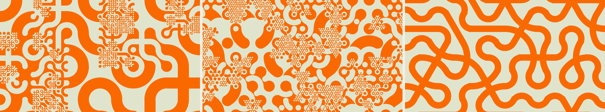

# Multi-Scale Truchet Patterns

A Processing sketch that generates multi-scale Truchet tilings in the style of
[Christopher Carlson's "Multi-Scale Truchet Patterns"](https://christophercarlson.com/portfolio/multi-scale-truchet-patterns/).



## Running

Open `Multiscale_Truchet.pde` in the [Processing IDE](https://processing.org/) and press **Run**,
or from the command line:

```
processing-java --sketch=. --run
```

Two extra windows open alongside the visualization:
- a **Controls** window (`ControlWindow.pde`) with sliders/buttons for every
  parameter below;
- a **Tiles** window (`TileWindow.pde`) that previews each tile *archetype* of
  the current shape (the base connection sets, without rotations) with a slider
  per archetype setting how often it's chosen — i.e. it edits the active shape's
  weight array live (`TILE_W` / `TRI_W` / `HEX_W`). Set one to 0 to drop that
  tile; the relative values are the selection probabilities.

### Controls
- **SPACE** — generate a new random pattern
- **4** / **3** / **6** / **t** — square / triangle / hexagon / trapezoid tiling
- **p** / **P** — next / previous palette
- **R** — rotate the current palette's colour order
- **C** — cycle colour scheme (duotone → multi → gradient → gradient-bg → gradient-smooth)
- **g** — toggle the base-grid overlay (outlines the root tiles on top of the pattern)
- **S** — save the current frame as a **parameter-stamped PNG** (the filename
  encodes shape/scheme/seed/grid/depth/etc.), and print the exact headless command
  that reproduces it — bump `TRUCHET_SCALE` in that command to re-render the same
  composition at higher resolution

## How it works

*(This section describes the square; see [Shapes](#shapes-square--triangle--hexagon--trapezoid)
for triangles, hexagons, and trapezoids.)*

A quadtree covers the canvas: each cell either subdivides into four half-size cells
(with probability `subdivideProb`, up to `maxDepth`) or becomes a leaf tile.

The trick that makes tiles of different sizes connect:

- Every tile is drawn in a unit square. Wherever a band crosses an edge, the
  black/white boundary meets that edge at the **1/3 and 2/3** points, and the
  band occupies the central third (width = `s/3`, a stroke centred on the `s/2`
  midline, so corner arcs use radius `s/2`).
- A half-size tile abutting a larger one crosses the shared edge at the *same*
  points: the big tile's edge runs `[0..S]` with crossings at `S/3` and `2S/3`;
  the two half-size tiles along it cross at `S/6, S/3` and `2S/3, 5S/6` — so
  `S/3` and `2S/3` coincide exactly and the curves join.
- Colours **invert at each scale level** (`depth % 2`), so a band always meets
  the background of a finer neighbour, keeping the dividing curve continuous.

### Winged tiles (`winged`, default on)

The connection is made *structural* — independent of which motif each neighbour
picks — using Carlson's wings (as rendered in Steele's notebook):

- a **background disc at each corner** (radius `s/3`), and
- a **foreground disc at each edge midpoint** (radius `s/6`),

drawn **unclipped** so they spill past the tile boundary. The fg disc guarantees
a connection nub at the centre of every edge even when no band reaches it; the
bg disc keeps corners clean. Because a coarse tile's edge midpoint is exactly the
shared corner of the two half-size tiles along it, these discs land on the same
point and join the scales. Tiles are therefore drawn **coarse-first** so finer
tiles and their wings sit on top — Carlson's "smaller tiles on top of larger".
Set `winged = false` to fall back to plain bands relying only on colour inversion.

## Tile representation

Following Oliver Steele's
[Generalized Truchet Tiles](https://observablehq.com/@osteele/truchet-tile-generation),
a tile is just a list of **edge-pairs** `{i,j}` — "connect the midpoint of edge
`i` to the midpoint of edge `j`" (edges `0=N, 1=E, 2=S, 3=W`). Adjacent edges
draw a **corner arc**; opposite edges draw a **straight band**. The alphabet in
`TILE_CONNS` is the n=4 case of Steele's `sideConnectionSets` (every non-crossing
way to pair the four edges, gaps allowed); each tile is placed with a random
quarter-turn, so rotations cover the full square set:

| `conns` | tile |
|---------|------|
| `{}` | solid |
| `{0,1}` | single corner arc |
| `{0,2}` | single straight band |
| `{0,1},{2,3}` | diagonal arc pair (classic Truchet) |
| `{0,2},{1,3}` | crossing bands |

## Shapes (square / triangle / hexagon / trapezoid)

Steele's construction generalizes to any regular n-gon: a connection between
edge `i` and edge `j` is a circular arc whose centre is the **intersection of the
two edge lines** (radius = distance from an edge midpoint to that centre);
diametrically opposite edges connect with a straight band. `Shapes.pde`
implements four tilings (keys **4 / 3 / 6 / t**), all through one renderer:

| Shape | n | Multi-scale? | Subdivision |
|-------|---|--------------|-------------|
| **Square** | 4 | yes | quadtree — 4 half-size squares |
| **Triangle** | 3 | yes | rep-tile — 3 corner triangles + 1 flipped centre (the medial triangle) |
| **Hexagon** | 6 | yes | not a rep-tile, so it splits into 6 equilateral triangles (fanning from the centre) that then recurse |
| **Trapezoid** | (4) | yes | half-hexagon = 3 equilateral triangles; splits into those and recurses as triangles (like the hexagon) |

The square and triangle are genuine rep-tiles, so Carlson's recursive
subdivision and the winged cross-scale connection both apply. A regular hexagon
*cannot* be cut into smaller regular hexagons, so a whole (un-subdivided) hexagon
is a single tile drawn with **fully-connected tiles** (every edge paired) and
**no wings** — the classic "arc crosses each edge at its midpoint" connection.
When a hexagon subdivides it becomes **6 equilateral triangles** (each = centre +
two adjacent vertices; the hexagon's side equals its circumradius, so they're
equilateral), and those recurse with the triangle rep-tile rule. So hexagon mode
mixes whole-hexagon tiles at the coarse scale with triangular detail where they
split — a shared hexagon edge is one triangle edge, so the grid still meets. Each
shape has its own alphabet (`TILE_CONNS`, `TRI_CONNS`, `HEX_CONNS`) and is placed
with a random rotation; `subdivideProb` controls how often hexagons triangulate.

The **trapezoid** (half a hexagon) is the exception to the regular-n-gon
machinery: its **long edge carries two ports** (Mitchell's multiple-points-per-side
generalization), giving 5 ports — an odd number, so every whole-trapezoid motif
leaves one port unmatched, capped by a foreground wing nub. It is stored not as
`(cx,cy,R,rot)` but as a complex similarity `world(z) = p0 + z·e` over a canonical
unit tile, and its six connections are arcs with explicit centres (each on both
ports' edge lines, so crossings stay perpendicular at width `side/3`), with its own
whole-tile alphabet (`TRAP_CONNS` / `TRAP_W`). For multi-scale it follows the
hexagon strategy: a half-hexagon is exactly **3 unit equilateral triangles**, so it
**subdivides into those and recurses them as triangles** — lattice-preserving, so
the fine detail connects seamlessly to whole trapezoids and to neighbouring
subdivided ones (the 3 triangles' boundary edges reproduce the trapezoid's exact
ports: long edge = two triangle bases, top + each leg = one triangle edge each).
Ported from `trapezoid_prototype.py`.

### Rendering & seams

Each tile's whole motif is stroked as a **single Java2D path** (all of its bands
in one `g2.draw`), so overlapping bands within a tile form one antialiased shape
— no 1px gaps where separately-drawn strokes would meet. (Processing's `clip()`
is rectangle-only, so the renderer reaches the JAVA2D backend's `Graphics2D`
directly; see `Shapes.pde`.)

Across tiles the schemes differ:
- **Square / triangle** clip each motif to its polygon (a safety net against wide
  arcs) and use **wings** — the foreground discs at edge midpoints bridge the
  joins between neighbouring tiles.
- **Whole hexagons** have no wings, so to avoid hairline seams between adjacent
  tiles *all* hexagon bands are accumulated into **one path and stroked once**
  (`strokeHexBatch`) — the entire hexagon layer becomes a single antialiased
  shape with no internal seams. (They're all the same colour at depth 0; the
  per-tile `gradient` scheme is the exception and falls back to per-tile.) Bands
  use a `ROUND` cap so they overlap smoothly across edges. The hexagon alphabet
  includes **distance-2 "sweeping" arcs** — large curves spanning a tile; those
  stay within the hexagon by construction.

## Colour

Colours come from a `PaletteManager` (`Palettes.pde`), seeded with a snapshot of
[COLOURlovers](https://www.colourlovers.com/palettes/new/all-time/meta)'
all-time most-loved palettes (and able to refresh live via `tryLoadLive()`).
Two `colorScheme`s:

- **duotone** (`0`, default): the palette's lightest colour as ground and darkest
  as the band/wing colour, inverted each scale level (`invertPerLevel`).
- **multi** (`1`): a constant light ground with a *different* palette colour per
  scale level (darkest first, so the coarsest tiles get the boldest ribbon).
- **gradient** (`2`): one palette colour, chosen at random, is the solid ground;
  the other colours form a gradient (in a random direction) that the bands sample
  by position — one colour per tile (so it steps slightly tile to tile).
- **gradient-bg** (`3`): the flip, with *smooth* interpolation — a continuously
  interpolated gradient of the other colours fills the whole canvas, and the one
  random colour is the solid ribbons. The tiles skip their background fill so the
  gradient shows through the negative space.
- **gradient-smooth** (`4`): like `gradient` (solid ground, the others as the
  ribbon colour) but the ribbons are painted with the gradient *continuously* —
  a true gradient-filled stroke (Java2D `LinearGradientPaint`) so the colour
  flows smoothly along the bands instead of stepping one flat colour per tile.

For all three gradient schemes the random pairing is fixed per seed — press
**SPACE** for a new one, or **R** to rotate the palette and re-pair the same
structure. (`gradient` keeps the faceted, one-colour-per-tile look;
`gradient-smooth` is the continuous version of it.)

Cycle palettes with **p**/**P**, rotate the current palette's colour order with
**R**, and cycle schemes with **C** at runtime. Palette rotation is most visible
in the gradient scheme (it changes which colour is solid and reorders the
gradient stops).

## Tuning

All parameters live at the top of `Multiscale_Truchet.pde`:

| Parameter | Effect |
|-----------|--------|
| `gridN` | top-level cells per side |
| `maxDepth` | how many times a cell may subdivide |
| `subdivideProb` | how often cells split (higher = busier, finer detail) |
| `shapeMode` | `0` square / `1` triangle / `2` hexagon / `3` trapezoid (see Shapes) |
| `showGrid` | overlay the base root-tile lattice on top of the render (key **g**) |
| `colorScheme` | `0` duotone / `1` multi / `2` gradient / `3` gradient-bg / `4` gradient-smooth (see Colour) |
| `winged` | draw Carlson wings (structural connection discs) |
| `invertPerLevel` | flip colours each scale level (duotone) |
| `imageMode` / `imagePath` | render a source image as a Truchet halftone (see Image mode) |
| `imgCols` / `libSize` / `imgGamma` | halftone resolution / brightness-library size / midtone gamma |
| `imgStretch` / `imgInvert` / `imgContain` | stretch tones to the library range / invert the mapping / fit-whole vs cover/crop |
| `TILE_CONNS` / `TRI_CONNS` / `HEX_CONNS` / `TRAP_CONNS` | per-shape tile alphabets (in `Shapes.pde`) |

Palette colours are set in `Palettes.pde` (`loadDefaults()`).

With `winged` on, low-connectivity tiles (blank, single-arc) leave a connection
nub on each gap edge, so sparse regions read as fields of dots. The default
`TILE_W` favours well-connected tiles (diagonal arcs, crosses) to match Carlson's
flowing look; raise the blank/single weights for a dottier pattern.

## Image mode (Truchet halftone)

Render any image as a mosaic of multi-scale Truchet tiles, like ASCII art whose
"glyphs" are little tilings (`ImageMode.pde`). It works in two phases:

1. **Calibrate** — generate a library of candidate patches (each one square cell
   subdivided to its own density), render them and measure the **average
   brightness** of each in the active palette.
2. **Compose** — sample the source image's brightness per grid cell and drop in
   the patch whose brightness matches: dark regions get ink-dense, deeply
   subdivided tiles; bright regions get sparse dots.

**In the app:** the **Image mode** section at the bottom of the Controls panel —
*Load image…*, then tune *img cols* (resolution), *img lib* (library size),
*img gamma*, and the *stretch* / *invert map* toggles. Brightness is measured in
whatever palette/scheme is active, so changing the palette re-derives the mapping.

**Headless** (renders one PNG and exits):

```sh
TRUCHET_OUT=/tmp/out.png TRUCHET_IMG=/path/to/photo.png \
  TRUCHET_IMG_COLS=48 TRUCHET_IMG_LIB=200 \
  processing-java --sketch="$PWD" --run
```

| Env var | Effect |
|---------|--------|
| `TRUCHET_IMG` | source image path (enables image mode) |
| `TRUCHET_IMG_COLS` | mosaic columns (rows follow the canvas aspect) |
| `TRUCHET_IMG_LIB` | number of candidate patches measured (default 256) |
| `TRUCHET_IMG_GAMMA` | gamma on cell brightness (>1 darkens midtones) |
| `TRUCHET_IMG_STRETCH` | `1` (default) maps image tones across the library's full range |
| `TRUCHET_IMG_INVERT` | `1` inverts the mapping (dark image → bright tiles) |
| `TRUCHET_IMG_CONTAIN` | `1` (default) fits the whole image (pads with bright bg); `0` covers/crops to the canvas aspect |

**High-resolution export.** The tiling is resolution-independent, so the same
seed renders identically at any canvas size — only crisper. Set
`TRUCHET_SCALE` (multiplies the 1920×1080 default — `2` → 4K, `4` → 8K) or
`TRUCHET_W`/`TRUCHET_H` (explicit pixels). Use the headless path for a big PNG
without a giant on-screen window (window == canvas in Processing):

```sh
TRUCHET_SCALE=2 TRUCHET_OUT=/tmp/4k.png TRUCHET_SEED=11 \
  processing-java --sketch="$PWD" --run
```

Transparent PNGs (logos, SVG exports) are flattened onto white on load, so a
black-on-transparent logo reads as dark ink on a bright field rather than
collapsing to one uniform tile. Use *contain* (default) to keep the whole logo
visible, or *cover* to fill the frame with a photo.

Combine with `TRUCHET_SCHEME` / `TRUCHET_PALETTE` to halftone in colour.
